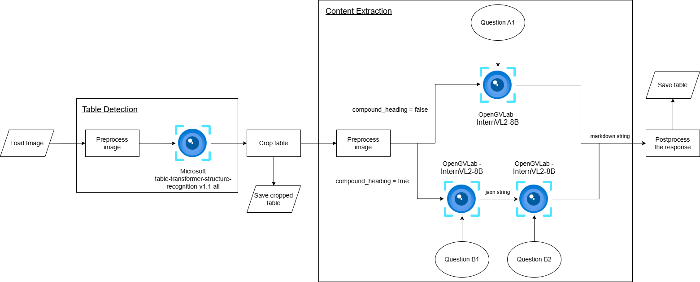
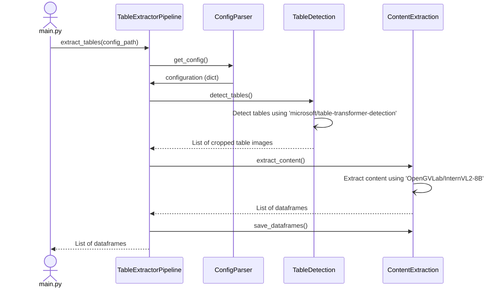

# Table Extractor

## Table of Contents
1. [Introduction](#introduction)
2. [Architecture](#architecture)
3. [Sequence Diagram](#sequence-diagram)
4. [Configuration Parameters](#configuration-parameters)
5. [Execution](#execution)
6. [Results](#results)
7. [Observations](#observations)
8. [References](#references)

---

## Introduction

This pipeline is designed to extract text data from tables in images while preserving the relationships between the table's cells.

- **Input:** Image
- **Output:** List of dataframes

The following models are used:
1. Table Detection: [**microsoft/table-transformer-detection**](https://huggingface.co/microsoft/table-transformer-detection)
2. Content Extraction: [**OpenGVLab/InternVL2-8B**](https://huggingface.co/OpenGVLab/InternVL2-8B)

---

## Architecture



Pipeline A:
- *Question A1:* 

    "\<image\>\n Structure the text into a table as shown in the image. Don't include a preamble."

The LLM is called only once. It returns the markdown table.

Pipeline B:
- *Question B1:* 

    "\<image\>\n Structure the text into a table as shown in the image. Return a json. Return multiple json if there are multiple tables. Don't include a preamble."
- *Question B2:* 

    f"\<json\>{json_response}\</json\>\n Convert json to table."

The LLM is called twice. First time it structures the text in the table into a json. Second time, it converts the json into a markdown table.

---

## Sequence Diagram



---

## Configuration Parameters

The configuration file is found at `./code/config.json`

| Parameter | Description | Type | Default | Required |
| --------- | ----------- | ---- | ------- | -------- |
| input_path | Input path for image | string | - | &#x2713; |
| output_path | Folder path to store output files | string | ./outputs/ | &#x2718; |
| table_detection_threshold | Threshold for table detection | float | 0.9 | &#x2718; |
| padding | Padding to crop detected tables | int | 10 | &#x2718; |
| max_new_tokens | Max new tokens generated by the llm | int | 1024 | &#x2718; |
| load_in_8bit | 8-bit quantization with bitsandbytes. If false, 4-bit quantization will be used | boolean | False | &#x2718; |
| use_pipeline_a | If true- use pipeline A, else use pipeline B.  | boolean | True | &#x2718; |
| log_file_path | If log_file_path is not given, log file is not created and the logs are only printed on the command line. | string | None | &#x2718; |
| save_temp_files | If true- save cropped table image, and box cordinates | boolean | True | &#x2718; |
| cache | Folder path to store model cache files | string | ./cache/ | &#x2718; |

---

## Execution

1. [Create and activate Python virtual environment](https://dev.to/shriekdj/how-to-create-and-activate-the-virtual-environment-for-python3-project-3g4l)
2. Install the required libraries
```
pip install -r ./code/pipeline4/requirements.txt
```
> **Note**: The execution of the large language model requires a GPU with CUDA installed. The version of pytorch, CUDA and related libraries depends on the hardware. The requirements file provided installs - torch==2.4.0+cu121, and torchvision==0.19.0+cu121. Please install the appropriate libraries from [Pytorch Get Started](https://pytorch.org/get-started/locally/).
3. Install flash-attention
```
pip install flash_attn==2.6.3
```
> **Note**: The OpenGVLab/InternVL2-8B model requires [flash-attention](https://github.com/Dao-AILab/flash-attention) which can take a long time to install.
4. Update the config file with desired parameters.
5. Run the main file
```
python ./code/main.py
```

---

## Results

- Average time taken Pipeline A - 
- Average time taken Pipeline B - 

---

## Observations

- The [**OpenGVLab/InternVL2-8B**](https://huggingface.co/OpenGVLab/InternVL2-8B) is able to efficiently extract textual data from tables while preserving the relationships between the table's cells.
- It can extract German and English languages without user input.
- It can detect multiple tables in a single image.
- Pipeline A works well in most simple cases and is faster.
- Pipeline B does a good job for compound headings. Conversion of tables with compound headers to JSON format allowed Pipeline B to produce accurately formatted strings by merging the headings.

---

## References

1. [microsoft/table-transformer-detection](https://huggingface.co/microsoft/table-transformer-detection)
2. [OpenGVLab/InternVL2-8B](https://huggingface.co/OpenGVLab/InternVL2-8B)
3. [OpenGVLab/InternVL Spaces](https://huggingface.co/spaces/OpenGVLab/InternVL)
4. [Table Transformer](https://huggingface.co/docs/transformers/en/model_doc/table-transformer)
4. [Multi-Modal on PDF’s with tables](https://docs.llamaindex.ai/en/v0.9.48/examples/multi_modal/multi_modal_pdf_tables.html)
5. [TC-OCR: TableCraft OCR for Efficient Detection & Recognition of Table Structure & Content](https://arxiv.org/html/2404.10305v1)
6. [Inference with table transformer](https://github.com/microsoft/table-transformer/blob/main/docs/INFERENCE.md)
7. [Table transformers tutorials](https://github.com/NielsRogge/Transformers-Tutorials/tree/master/Table%20Transformer)
8. [Table Bank](https://github.com/doc-analysis/TableBank/tree/master)
9. [Table Bank dataset](https://paperswithcode.com/dataset/tablebank)

---