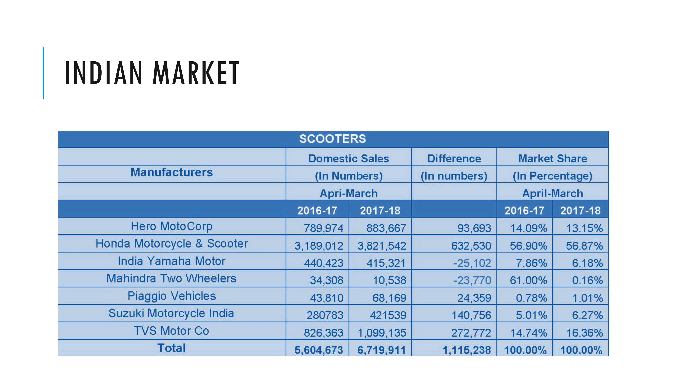

# Table Extractor

## Table of Contents
1. [Introduction](#introduction)
2. [Architecture](#architecture)
3. [Sequence Diagram](#sequence-diagram)
4. [Configuration Parameters](#configuration-parameters)
5. [Execution](#execution)
6. [Results](#results)
7. [Conclusions](#Conclusions)
8. [References](#references)

---

## Introduction

This pipeline is designed to extract text data from tables in images while preserving the relationships between the table's cells.

- **Input:** Image
- **Output:** List of dataframes

The following models are used:
1. Table Detection: [**microsoft/table-transformer-structure-recognition-v1.1-all**](https://huggingface.co/microsoft/table-transformer-structure-recognition-v1.1-all)
2. Content Extraction: [**OpenGVLab/InternVL2-8B**](https://huggingface.co/OpenGVLab/InternVL2-8B)

---

## Architecture


compound_heading = false:
- *Question A1:* 

    "\<image\>\n Structure the text into a table as shown in the image. Don't include a preamble."

The LLM is called only once. It returns the markdown table.

compound_heading = true:
- *Question B1:* 

    "\<image\>\n Structure the text into a table as shown in the image. Return a json. Return multiple json if there are multiple tables. Don't include a preamble."
- *Question B2:* 

    f"\<json\>{json_response}\</json\>\n Convert json to table."

The LLM is called twice. First time it structures the text in the table into a json. Second time, it converts the json into a markdown table.

---

## Sequence Diagram


---

## Configuration Parameters

The configuration file is found at `./code/config.json`

| Parameter | Description | Type | Default | Required |
| --------- | ----------- | ---- | ------- | -------- |
| input_path | Input path for image | string | - | &#x2713; |
| output_path | Folder path to store output files | string | ./outputs/ | &#x2718; |
| table_detection_threshold | Threshold for table detection | float | 0.9 | &#x2718; |
| padding | Padding to crop detected tables | int | 10 | &#x2718; |
| max_new_tokens | Max new tokens generated by the llm | int | 1024 | &#x2718; |
| load_in_8bit | 8-bit quantization with bitsandbytes. If false, 4-bit quantization will be used | boolean | False | &#x2718; |
| compound_heading | Content extraction is handled differently if the table contains compound heading  | boolean | False | &#x2718; |
| log_file_path | If log_file_path is not given, log file is not created and the logs are only printed on the command line. | string | None | &#x2718; |
| save_temp_files | If true- save cropped table image, and box cordinates | boolean | True | &#x2718; |
| cache | Folder path to store model cache files | string | ./cache/ | &#x2718; |

---

## Execution

1. [Create and activate Python virtual environment](https://dev.to/shriekdj/how-to-create-and-activate-the-virtual-environment-for-python3-project-3g4l)
2. Install the required libraries
```
pip install -r ./code/pipeline4/requirements.txt
```
> **Note**: The execution of the large language model requires a GPU with CUDA installed. The version of pytorch, CUDA and related libraries depends on the hardware. The requirements file provided installs - torch==2.4.0+cu121, and torchvision==0.19.0+cu121. Please install the appropriate libraries from [Pytorch Get Started](https://pytorch.org/get-started/locally/).
3. Install flash-attention
```
pip install flash_attn==2.6.3
```
> **Note**: The OpenGVLab/InternVL2-8B model requires [flash-attention](https://github.com/Dao-AILab/flash-attention) which can take a long time to install.
4. Update the config file with desired parameters.
5. Run the main file
```
python ./code/main.py
```

---

## Results

### Example 1

### *Input:*


### *Output:*

| Branch Name | Dickman Street |
| --- | --- |
| Branch Number | IDICK |
| Section Number | 01 |
| Section Length | 414 LF |
| Section Width | 21 LF |
| Section Area | 966 SY |

| Inspection Date | 12/03/79 |
| --- | --- |
| PCI | 53 |
| Rating | Fair |
| Condition | Riding-C1 Safety-C1 Drainage-C1 Shoulders-C1 Overall-C1 |

| Total Number of Samples in Section | 4 |
| --- | --- |
| Number of Samples Surveyed | 4 |
| Recommend All Sample Units to be Surveyed |  |

| Distress Type | Severity | Quantity | Density-PCT | Deduct-Value |
| --- | --- | --- | --- | --- |
| Alligator CR | High | 15 SF | 0.17 | 14.2 |
| Alligator CR | Low | 680 SF | 7.82 | 29.5 |
| Alligator CR | Medium | 60 SF | 0.69 | 17.7 |
| Bleeding | Low | 8 LF | 0.09 | 0.0 |
| Depression | Low | 18 SF | 0.20 | 4.0 |
| Edge CR | High | 4 LF | 0.04 | 7.4 |
| Long/Trans CR | Low | 287 LF | 3.30 | 7.6 |
| Patch/Util Cut | Low | 100 SF | 1.15 | 2.4 |
| Patch/Util Cut | Medium | 50 SF | 0.57 | 7.0 |
| Pothole | High | 4 NMBR | 0.04 | 40.2 |
| Rutting | Low | 10 SF | 0.11 | 1.0 |

---

### Example 2

### *Input:*


### *Output:*

| Land         | Sprache   | Land         | Sprache   |
| ------------- | --------- | ------------- | --------- |
| Deutschland  | Deutsch   | Polen        | Polnisch  |
| Österreich    | Deutsch   | die Türkei   | Türkisch  |
| die Schweiz   | Französisch, Italienisch, Römanisch | Russland   | Russisch  |
| Frankreich   | Französisch | Ägypten     | Arabisch  |
| Großbritannien | Englisch  | Japan        | Japanisch |
| Italien      | Italienisch | die USA     | Englisch  |
| Spanien      | Spanisch   | China        | Chinesisch |

---

### Example 3

### *Input:*


### *Output:*

| **Person**   | **Was kann man damit machen?** | **Warum ist das den Personen wichtig?** |
|--------------|------------------------------|----------------------------------------|
| **Walkman**  | Musik hören, woo man war | Macht die Musik leiser |
| **Hawk-Eye** | Feststell, Ball im Ausstieg | Es ist fair |

---

### Example 4

### *Input:*



```
> compound_heading = True
```

### *Output:*

| Manufacturers                | 2016-17 Domesic Sales (In Numbers) | 2017-18 Domesic Sales (In Numbers) | Difference (In Numbers) | 2016-17 Market Share (In Percentage) | 2017-18 Market Share (In Percentage) |
|------------------------------|----------------------------------|----------------------------------|-----------------------|-------------------------------------|-------------------------------------|
| Hero MotoCorp                 | 789,974                          | 883,667                          | 93,693                | 14.09%                             | 13.15%                             |
| Honda Motorcycle & Scooter   | 3,189,012                        | 3,821,542                        | 632,530               | 56.90%                            | 56.87%                            |
| India Yamaha Motor           | 440,423                          | 415,321                          | -25,102               | 7.86%                             | 6.18%                             |
| Mahindra Two Wheelers        | 34,308                           | 10,538                           | -23,770               | 61.00%                            | 0.16%                             |
| Piaggio Vehicles              | 43,810                           | 68,169                           | 24,359                | 0.78%                             | 1.01%                             |
| Suzuki Motorcycle India      | 280,783                          | 42,1539                          | 140,756               | 5.01%                             | 6.27%                             |
| TVS Motor Co                 | 826,363                          | 1,099,135                        | 272,772               | 14.74%                            | 16.36%                            |
| **Total**                    | 5,604,673                        | 6,719,911                        | 1,115,238             | 100.00%                           | 100.00%                           |

---

## Conclusions

The [**OpenGVLab/InternVL2-8B**](https://huggingface.co/OpenGVLab/InternVL2-8B) is able to efficiently extract textual data from tables while preserving the relationships between the table's cells. It can handle different cases like:
- Tables without borders.
- Tables with printed and hand written text.
- Tables with different languages (English and German).
- Multiple tables in an image.
- By providing ```compound_heading = True```, we can get good results for tables with compound headings.

---

## References

1. [microsoft/table-transformer-structure-recognition-v1.1-all](https://huggingface.co/microsoft/table-transformer-structure-recognition-v1.1-all)
2. [OpenGVLab/InternVL2-8B](https://huggingface.co/OpenGVLab/InternVL2-8B)
3. [OpenGVLab/InternVL Spaces](https://huggingface.co/spaces/OpenGVLab/InternVL)
4. [Table Transformer](https://huggingface.co/docs/transformers/en/model_doc/table-transformer)
4. [Multi-Modal on PDF’s with tables](https://docs.llamaindex.ai/en/v0.9.48/examples/multi_modal/multi_modal_pdf_tables.html)
5. [TC-OCR: TableCraft OCR for Efficient Detection & Recognition of Table Structure & Content](https://arxiv.org/html/2404.10305v1)
6. [Inference with table transformer](https://github.com/microsoft/table-transformer/blob/main/docs/INFERENCE.md)
7. [Table transformers tutorials](https://github.com/NielsRogge/Transformers-Tutorials/tree/master/Table%20Transformer)
8. [Table Bank](https://github.com/doc-analysis/TableBank/tree/master)
9. [Table Bank dataset](https://paperswithcode.com/dataset/tablebank)

---